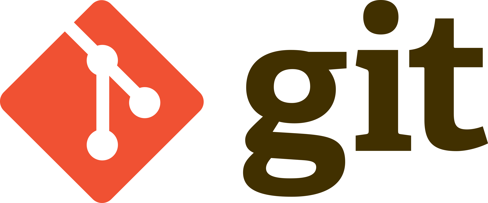

---
layout:
  width: wide
  title:
    visible: true
  description:
    visible: true
  tableOfContents:
    visible: true
  outline:
    visible: true
  pagination:
    visible: true
  metadata:
    visible: true
  tags:
    visible: true
  actions:
    visible: true
---

# Control de versiones: Git

<figure><figcaption></figcaption></figure>

[Git](https://git-scm.com/) es un software de control de versiones de ficheros de código fuente. Fue ideado y creado por Linus Torvalds en 2005 para facilitar el desarrollo cooperativo del kernel de Linux, es gratuito y de código abierto. La famosa plataforma [Github](https://github.com/),  que ofrece servicios de hosting de repositorios Git, fue comprada por Microsoft en 2018 por 7,500 millones de dólares. Por cierto, Github aloja el [repositorio oficial de Git](https://github.com/git/git).

Un sistema de control de versiones permite a los desarrolladores rastrear y administrar cambios en el código de tus proyectos, especialmente cuando se trabaja en equipo. Cuando varias personas colaboran en un proyecto, es difícil mantener el seguimiento de las revisiones: quién cambió qué ficheros y cuándo. Con un sistema de control de versiones, el programador está obligado a registrar y describir brevemente los cambios realizados sobre uno o varios ficheros (mediante la realización de _"commits"_), lo que permite mantener un seguimiento de todos los cambios que se han enviado al repositorio.

Las razones por las que usaremos Git en estas prácticas, y por las que deberíais usar Git en todos vuestros proyectos software, son las siguientes:

1. **Permite volver a versiones anteriores de uno o varios ficheros de forma sencilla y muy rápida.** En caso de haber realizado cambios negativos o indeseados sobre un repositorio Git, volver a la última versión correcta es tan facil como ejecutar un simple comando, que retrocede el repositorio al estado previo a los cambios realizados.
2. **Facilita el trabajo colaborativo**: distintos programadores pueden estar editando el mismo archivo, o versiones distintas del mismo archivo, o incluso versiones diferentes del proyecto a través de diferentes ramas de desarrollo, y todos los cambios serán reflejados en el documento final, si así se desea.&#x20;
3. **Permite generar flujos de trabajo** que facilitan el desarrollo y mantenimiento de proyectos de gran tamaño.
4. **Es muy eficiente,** ya que solo se almacenan las diferencias entre la versión anterior y la actualizada de cada fichero. Es decir, para cada fichero, Git guarda su versión incial + las diferencias (texto borrado, sustituido o insertado) tras cada actualización. Esto reduce considerablemente el tamaño del repositorio Git (lo que incluye todo el historial de cambios) así como los tiempos de despliegue en proyectos grandes, ya que no se "suben" de nuevo todos los ficheros del proyecto, sino únicamente las partes de código que cambian.
5. **Incluye un sistema de etiquetas**, para etiquetar las distintas versiones del proyecto (p.ej., 1.0, 1.1, 2.0, etc.).
