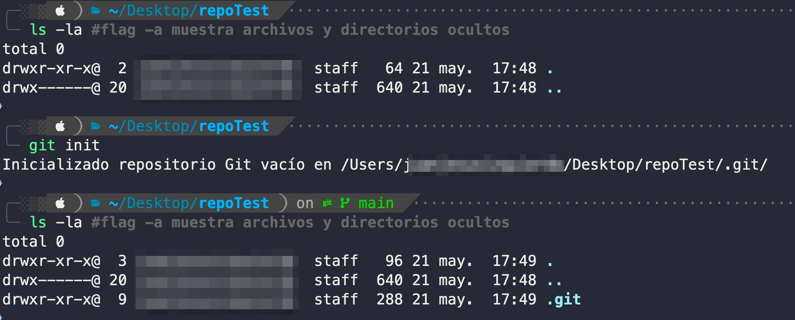
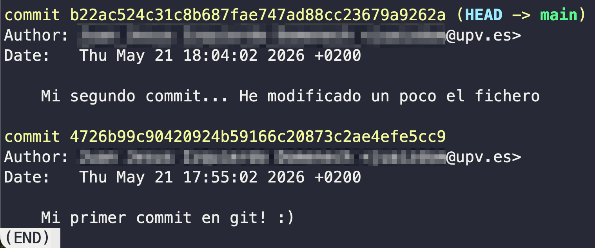
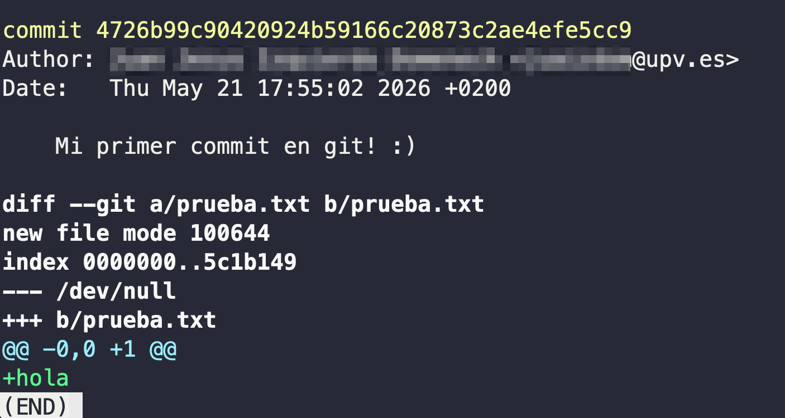
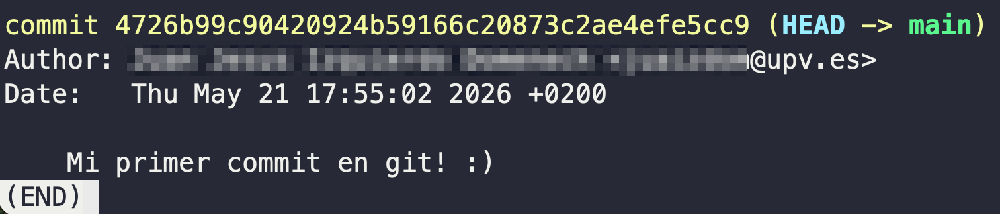

---
layout:
  width: wide
  title:
    visible: true
  description:
    visible: true
  tableOfContents:
    visible: true
  outline:
    visible: true
  pagination:
    visible: true
  metadata:
    visible: true
  tags:
    visible: true
  actions:
    visible: true
---

# Ejercicio 1: uso básico de git

## Inicializar un repositorio vacío

En la terminal, crea un directorio, accede a él, y inicializa un repositorio git vacío:

```bash
mkdir repoTest
cd repoTest
git init
```

Esto nos generará la siguiente salida, en la que nos informa que el repositorio se ha creado correctamente, y su base de datos se almacena en la carpeta (oculta) `repoTest/.git`.

<figure><figcaption></figcaption></figure>


También se puede crear un repositorio sobre un directorio (proyecto) existente. En ese caso, después de inicializar el repositorio, añadiríamos todos los ficheros y directorios en un gran _commit_ inicial (ver pasos 3 y 4).



**Cuidado!** Excepto `git init`, el resto de comandos de `git` solo funcionarán correctamente si se ejecutan desde un directorio que esté "dentro" del repositorio.


***

## Crear fichero y consultar estado del directorio de tabajo&#x20;

Crea con [Vim](../../editor-de-codigo-vim/) un fichero de texto llamado `prueba.txt`, escribe algo dentro, guarda los cambios a disco y sal (recuerda, comando `:wq`).&#x20;

A continuación:

```bash
git status
```

Esto generará esta salida, en la que nos avisa que en el directorio de trabajo hay un archivo sin seguimiento (que no existe en la base de datos):

<figure><figcaption></figcaption></figure>

***

## Preparar archivo (_stage_) para  su posterior confirmación

Para añadir el archivo `prueba.txt` al área de preparación de git (stage área), debemos invocar el comando `git add`, seguido del nombre del fichero que queremos añadir:

```bash
git add prueba.txt
```

Si el fichero `prueba.txt` existe, el comando `git add` no generará ninguna salida (solo mostrará información en caso de error). A continuación, haremos `git status` para asegurarnos que, efectivamente, el fichero modificado está en el área de stage y está pendiente de confirmación:

<figure><figcaption></figcaption></figure>

***

## Confirmar cambios (_commit_)

Para confirmar _("commitear")_ todos los cambios que hemos añadido previamente al área de preparación, debemos invocar el comando `git commit`, acompañado de un mensaje informativo (usando la opción `-m`  o `--message`).

```bash
git commit -m 'Mi primer commit en git! :)'
```

Esto nos genera esta salida, que nos confirma la realización del commit:

<figure><figcaption></figcaption></figure>

***

## Modificar un fichero existente, consultar estado y diferencias

Edita el fichero con Vim, añadiendo alguna línea más. Guarda y sal. A continuación:

```bash
git status
```

Esto nos generará la siguiente salida, en la que se nos informa que hay cambios sin preparar en un fichero:

<figure><figcaption></figcaption></figure>

Ahora vamos a consultar las diferencias existentes entre el directorio de trabajo y la base de datos:

```bash
git diff
```

Esto nos generará la siguiente salida:

<figure><figcaption></figcaption></figure>

* `a/prueba.txt` es la versión anterior\
  `b/prueba.txt` es la versión posterior
* `index` son identificadores de git de los ficheros, así como los permisos
* `--- a/prueba.txt` indica la versión anterior del fichero\
  `+++ b/prueba.txt` indica la versión posterior del fichero
* `@@ -1 +1,2 @@` indican que líneas han cambiado
  * `-1` → en la versión antigua había 1 línea\
    `+1,2` → en la versión nueva hay 2 líneas empezando desde la línea 1
* `hola` aparece sin cambios\
  `+adios` aparece en verde y con `+` (se ha añadido esta línea)\
  si se hubiera eliminado, aparecería un `-`

***

## Preparar archivo (_stage_)

Para añadir el archivo modificado al área de preparación de git (stage área), debemos invocar de nuevo el comando `git add`, seguido del nombre de fichero o ficheros que queremos añadir:

<pre class="language-bash"><code class="lang-bash"><strong>git add prueba.txt
</strong></code></pre>

A continuación, haremos `git status` para asegurarnos que, efectivamente, el fichero modificado está en el área de stage y está pendiente de confirmación:

<figure><figcaption></figcaption></figure>

***

## Confirmar cambios (_commit_)

Para confirmar _("commitear")_ todos los cambios que hemos añadido previamente al área de preparación, debemos invocar de nuevo el comando `git commit`.

```bash
git commit -m 'Mi segundo commit... He modificado un poco el fichero'
```

***

## Examinar el historial de commits

Para examinar el historial de confirmaciones (commits) realizadas en el repositorio, usaremos el comando `git log` :

```bash
git log
```

Ejecutarlo mostrará por pantalla una salida similar a esta:

<figure><figcaption></figcaption></figure>

Como veis, cada commit viene acompañado por:

* Un identificador (p.e. `b22ac5...`) único.
* Nombre, apellidos, y correo electrónico del autor del commit.
* Fecha y hora de realización del commit.
* Mensaje informativo del commit.

Si quisiéramos consultar el historial de commits para un único fichero en concreto, entonces deberemos añadir el nombre del fichero en cuestión a continuación de `git log`:

```bash
git log prueba.txt
```

***

## Consultar diferencias entre dos versiones

En caso de querer comparar dos versiones diferentes de un fichero concreto o de todo el proyecto, utilizaremos el comando `git diff`. Por simplicidad, únicamente mostraremos la comparación entre la versión actual del repositorio, y la versión determinada por el primer commit, cuyo identificador es `4726b...` de acuerdo con la información proporcionada por `git log` . Entonces, se ejecutaría de esta manera:

```bash
git diff el_identificador_de_tu_primer_commit
```

Esto mostrará por pantalla las diferencias de ficheros entre la última versión del repositorio y la versión apuntada por el primer commit (con identificador `4726b...`), para TODOS los ficheros del repositorio.

<figure><figcaption></figcaption></figure>

Si quisiéramos hacer la misma consulta para un único fichero en concreto (en lugar de para todos los ficheros del proyecto), entonces debemos añadir a continuación del comando el nombre del fichero en cuestión:

```bash
git diff el_identificador_de_tu_primer_commit prueba.txt
```

***

## Consultar una versión anterior de un fichero

Vamos a consultar/obtener la versión inicial del fichero `prueba.txt`. Esta se añadió en el primer commit (con identificador  `88ef...`):

```bash
git show el_identificador_de_tu_primer_commit prueba.txt
```

Esto nos mostrará por pantalla los contenidos del fichero `prueba.txt` en este momento preciso de la historia del repositorio:

<figure><figcaption></figcaption></figure>

***

## Recuperar una versión anterior (eliminando los commits posteriores) <a href="#id-11.-recuperar-una-version-anterior-eliminando-los-commits-posteriores" id="id-11.-recuperar-una-version-anterior-eliminando-los-commits-posteriores"></a>

Vamos a recuperar la versión inicial del fichero `prueba.txt`, eliminando todos los commits posteriores (solo uno). Para ello haremos uso de la orden reset:

```bash
git reset el_identificador_de_tu_primer_commit --hard
```

Esto nos genera la siguiente salida, la cual nos confirma que se ha efectuado el reset:

<figure><figcaption></figcaption></figure>

Si consultamos el historial de cambios, veremos que el segundo commit ha desaparecido:

```bash
git log
```

<figure><figcaption></figcaption></figure>

Y si consultamos el contenido del fichero `prueba.txt`, veremos que, efectivamente, es el correspondiente a la versión del primer commit:

<figure><figcaption></figcaption></figure>
