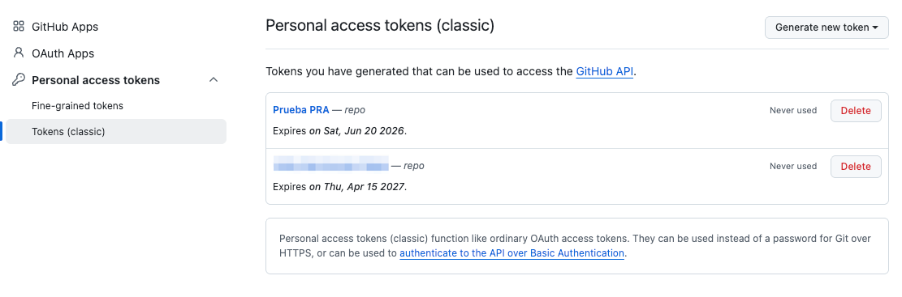
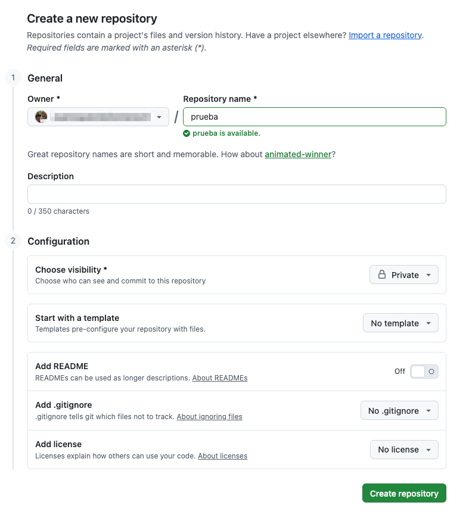
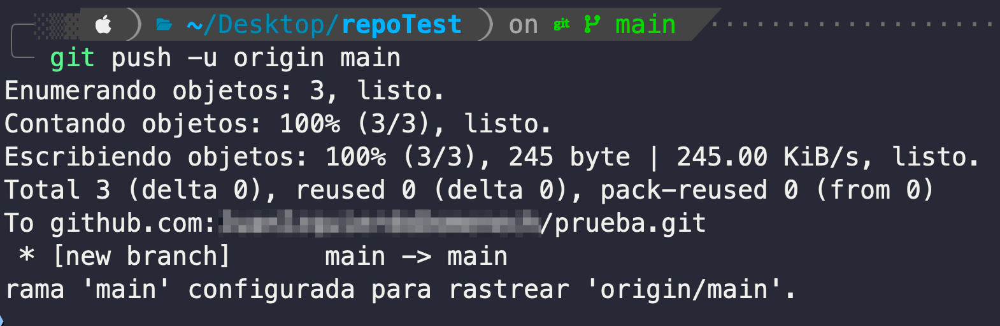
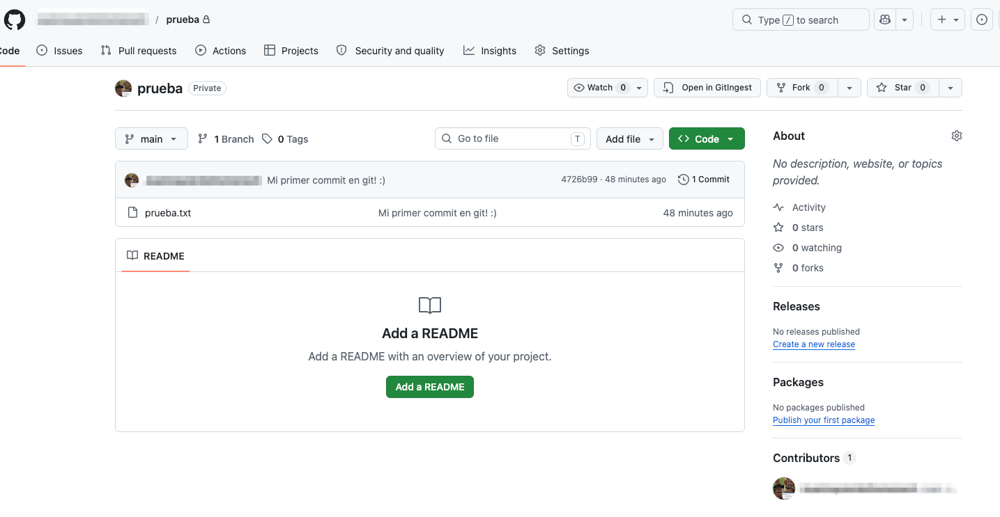
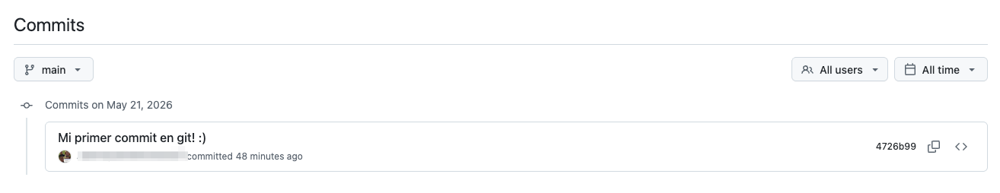
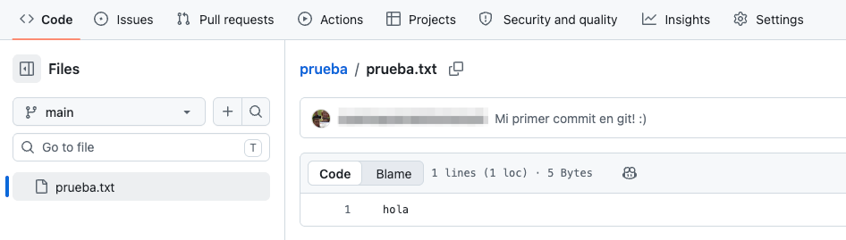

# Ejercicio 2: sincronizando un repositorio local con un repositorio remoto

<figure><figcaption></figcaption></figure>

## Crea una cuenta en Github y genera un token de acceso personal

En primer lugar, accede a [https://github.com/signup](https://github.com/signup) y **crea una cuenta de GitHub**, si no la tienes.

A continuación, vamos a **generar un token de acceso personal**, necesario para poder autenticarnos con nuestra cuenta de Github a través del cliente de linea de comandos.

1. Dirígete a _"Settings" -> "Developer Settings" -> "Personal Access Tokens" -> "Tokens (classic)" -> "Generate New Token (classic)"_.&#x20;
2. Dale un nombre al token,&#x20;
3. marca el checkbox _"repo"_ para darle permisos de escritura a repositorios privados,&#x20;
4. y haz clic al botón _"Generate token"_ que hay abajo del todo.&#x20;
5. **Copia el token que aparece en la pantalla de confirmación y guárdalo en un lugar seguro** (no lo podrás consultar nunca más!).&#x20;
   1. Ten en cuenta que el token dejará de funcionar pasados los dias de expiración especificados (por defecto, 30 días).

<figure><figcaption><p>Creación del token</p></figcaption></figure>

<figure><figcaption><p>Listado de tokens actuales</p></figcaption></figure>

***

## Crea un repositorio vacío

Busca el botón _"New"_, y crea un repositorio llamado _"prueba"_, de tipo privado, y sin README (dejar checkbox desmarcado, como en la imagen):

<figure><figcaption></figcaption></figure>

Copia en el portapapeles la URL HTTPS del repositorio que acabas de crear y que se muestra en la pantalla de confirmación (p.e. `https://github.com/tuusuarioupv/prueba.git`).

***

## Añadir repositorio remoto de GitHub al repositorio local

Dirígete al directorio en el que se encuentra el repositorio git local creado en el [Ejercicio 1](ejercicio-1-uso-basico-de-git.md). Por ejemplo:

```bash
cd /home/TU_USUARIO/repoTest # Adapta la ruta
```

A continuación, añadiremos el repositorio remoto que acabamos de crear en GitHub:

```bash
git remote add origin https://github.com/tuusuarioupv/prueba.git # Pon aquí tu URL!
```

***

### Configurar y sincronizar la rama master con el repositorio remoto de Github <a href="#id-3.-configurar-y-sincronizar-la-rama-master-con-el-repositorio-remoto-de-github" id="id-3.-configurar-y-sincronizar-la-rama-master-con-el-repositorio-remoto-de-github"></a>

Vamos a configurar la rama master para que siga el repositorio remoto de Github, y de paso, sincronizaremos los archivos (1 archivo) y el historial de commits (1 commit).

```bash
git push -u origin main
```

Nos pedirá el nombre de usuario de GitHub y una contraseña (a no ser que hayas [generado](https://docs.github.com/es/authentication/connecting-to-github-with-ssh/generating-a-new-ssh-key-and-adding-it-to-the-ssh-agent) y [configurado](https://docs.github.com/es/authentication/connecting-to-github-with-ssh/adding-a-new-ssh-key-to-your-github-account) en GitHub las claves SSH). **Como contraseña deberás introducir el token de acceso personal que hemos generado en el paso 0** (no la contraseña de acceso web!).

Esto nos generará una salida similar a esta:

<figure><figcaption></figcaption></figure>

Si vamos a nuestro repositorio en GitHub, comprobaremos que se han subido los ficheros y el historial de commits:

<figure><figcaption></figcaption></figure>

<figure><figcaption></figcaption></figure>

Examinando el fichero `prueba.txt`, comprobamos que tiene el mismo contenido que en el repositorio local:

<figure><figcaption></figcaption></figure>

***

## Trabajo con el repositorio remoto

A partir de este momento, para enviar/subir al repositorio de GitHub cualquier commit o conjunto de commits que realicemos sobre el repositorio local, deberemos ejecutar el comando:

```bash
git push
```

Si estamos trabajando nosotros solos en el proyecto, esto nos servirá para mantener una copia de seguridad de nuestro repositorio Git en la nube. Si por contra estamos trabajando colaborativamente con otros desarrolladores, esto nos permitirá ir integrando los avances de cada uno en el repositorio remoto. Para poder recuperar los commits del repositorio remoto que no estan en nuestro repositorio local, deberemos ejecutar:

```bash
git pull
```

<figure><figcaption></figcaption></figure>
