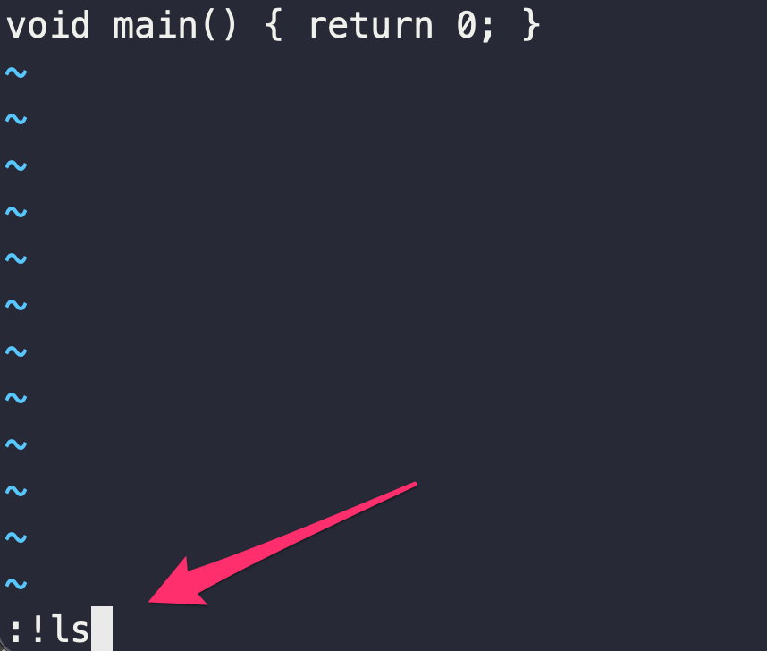
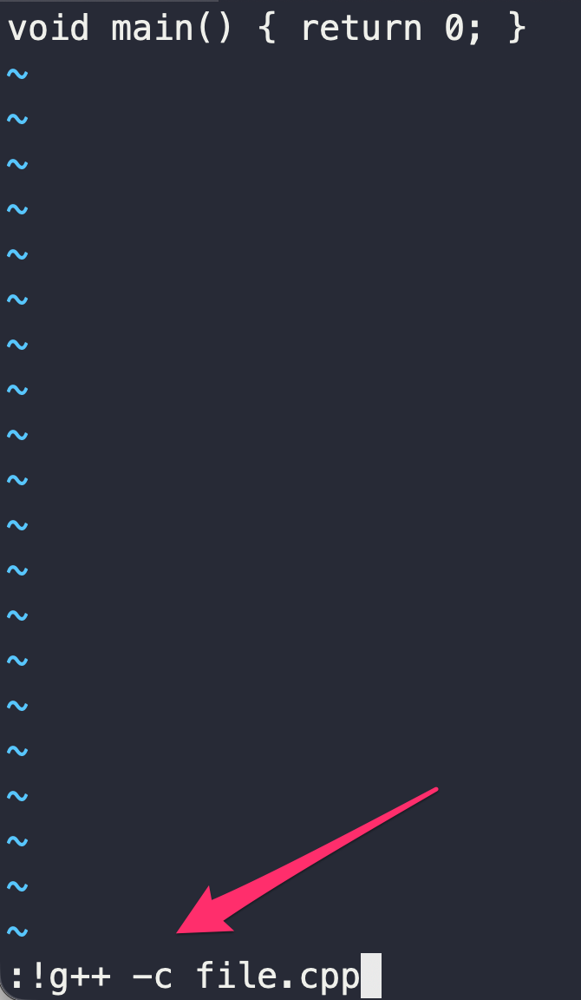

# Nociones básicas de Vim

## Lanzar Vim

Para lanzar Vim, debemos ejecutar el comando `vim` en la terminal, seguido del nombre de fichero que deseemos editar. Por ejemplo:

```bash
vim src/test.cpp
```

Si el fichero proporcionado como argumento fichero existe, leerá sus contenidos y los cargará en el buffer del programa; de lo contrario, se inciará vim con el buffer vacío, y solo creará dicho fichero si le pedimos posteriormente que guarde el contenido del buffer en disco.&#x20;

### Buffers

Vim trabaja principalmente con un buffer que contiene toda la información del fichero de texto que estamos editando. El contenido del buffer es lo que se muestra por la pantalla. Dicho buffer se almacena en la memoria principal del programa. La información del buffer únicamente se volcará en disco, en el fichero correspondiente, cuando lo pidamos explícitamente.&#x20;

### Portapapeles interno

Vim trabaja con un "portapapeles" interno que es totalmente independiente del portapapeles de sistema operativo (el que usamos con los atajos de teclado `CTRL+C` / `CTRL+X` / `CTRL+V`). Por tanto, cuando copiemos texto con los comandos de Vim, el contenido del portapapeles del SO no se verá afectado.&#x20;

***

## Modos de trabajo

Dentro de Vim, existen, principalmente, tres modos de trabajo: modo **comando**, **inserción**, y **visual**.

### Modo Comando (_Command Mode_)

Es el modo inicial con el que arranca Vim, desde el cual podemos **lanzar un sinfín de comandos diferentes** (ver Sección [Comandos básicos de Vim](comandos-basicos-de-vim.md)). Para asegurarnos de que estamos en el modo comando, debemos pulsar la tecla **`ESC`**.

### Modo Inserción _(Insert Mode)_

En este modo podemos **modificar el contenido del buffer**. Para poder acceder a él, estando en el modo comando, debemos pulsar la tecla **`i`** _(insert)._ Usaremos los cursores del teclado para movernos por el texto. Para salir de nuevo al modo comando, debemos pulsar la tecla `ESC`_._

### Modo Visual _(Visual Mode)_

En este modo podemos seleccionar, usando los cursores del teclado, los contenidos del buffer que deseemos para procesarlos posteriormente (copiar, borrar, reemplazar, etc.). Sería la operación equivalente, en un IDE con interfaz gráfica, a mantener pulsado el botón izquierdo y arrastrar el ratón para seleccionar texto. Para poder entrar en el modo visual, mientras estamos en el modo comando, debemos pulsar la tecla **`v`** _(visual)_. Para salir de nuevo al modo comando, debemos pulsar la tecla `ESC`_._

***

## Ejecutar otros programas sin salir de Vim

Conviene saber que se pueden ejecutar otros programas y comandos a través de la terminal sin necesidad de salir de Vim. Desde el modo comando, debemos escribir **`:!`**  seguido del comando de terminal que queramos ejecutar, exactamente como si estuviesemos en una terminal de Bash. Por ejemplo:

```
:!ls -l
```

Esto ejecutaría [el programa _ls_](../uso-de-la-terminal-de-comandos/comandos-basicos.md) del sistema, mostrando por pantalla los contenidos del directorio actual (ocultando el contenido del buffer). Pulsaríamos `ENTER` para volver de nuevo al buffer de Vim.

<div><figure><figcaption></figcaption></figure> <figure><figcaption></figcaption></figure></div>

Un caso de uso típico es compilar el fichero fuente que estamos editando, para comprobar si tiene errores de sintaxis. Por ejemplo, mientras estamos editando el fichero `test.cpp`, salimos al modo comando y escribimos:

```bash
:!g++ -c test.cpp
```

Esto nos mostraría por pantalla el resultado de compilar el fichero que estamos editando.&#x20;

<div><figure><figcaption></figcaption></figure> <figure><figcaption></figcaption></figure></div>

Otro caso de uso es ejecutar la herramienta Make (ver Capítulo [Automatización del proceso de compilación](../automatizacion-make/)) para que p.e. compile el proyecto entero:

```bash
:!make all
```
