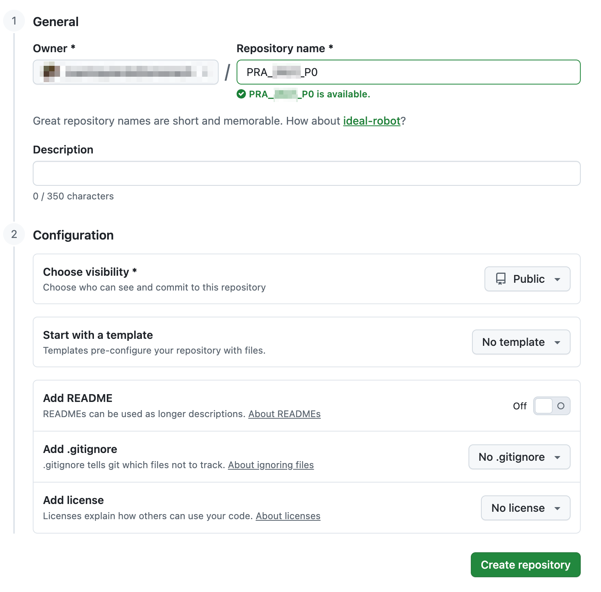

---
layout:
  width: wide
  title:
    visible: true
  description:
    visible: true
  tableOfContents:
    visible: true
  outline:
    visible: true
  pagination:
    visible: true
  metadata:
    visible: true
  tags:
    visible: true
  actions:
    visible: true
---

# Ejercicio final: proyecto "Brazo Robótico"

Para terminar, vamos a realizar un **ejercicio que ponga en práctica todas las herramientas que hemos visto**: terminal Bash, editor Vim, programación en C++, control de versiones con Git/GitHub, y automatización de la compilación con Make.&#x20;

Además, **este ejercicio te servirá para repasar la Programación Orientada a Objetos con C++**.&#x20;

Deberéis realizarlo <mark style="background-color:green;">**de forma individual**</mark>**&#x20;y&#x20;**<mark style="background-color:green;">**PASO A PASO**</mark>**&#x20;(deben haber 3 commits)**<mark style="background-color:green;">**.**</mark>


Es muy importante que realicéis esta actividad usando las herramientas presentadas, tal y como se indica en cada paso.&#x20;

El propósito principal de este actividad es que practiquéis con ellas y que aprendáis a utilizarlas.&#x20;


* Abre una terminal, crea un directorio, entra dentro de él, e inicializa un repositorio Git vacío.&#x20;
* Antes de nada, crea el fichero oculto `.gitignore` con el siguiente contenido, para que git no haga seguimiento de ciertos ficheros:

<details>

<summary>.gitignore</summary>

```md
# Prerequisites
*.d

# Compiled Object files
*.slo
*.lo
*.o
*.obj

# Precompiled Headers
*.gch
*.pch

# Linker files
*.ilk

# Debugger Files
*.pdb

# Compiled Dynamic libraries
*.so
*.dylib
*.dll
*.so.*

# Fortran module files
*.mod
*.smod

# Compiled Static libraries
*.lai
*.la
*.a
*.lib

# Executables
*.exe
*.out
*.app

# Build directories
build/
Build/
build-*/

# CMake generated files
CMakeFiles/
CMakeCache.txt
cmake_install.cmake
Makefile
install_manifest.txt
compile_commands.json

# Temporary files
*.tmp
*.log
*.bak
*.swp

# vcpkg
vcpkg_installed/

# debug information files
*.dwo

# test output & cache
Testing/
.cache/

# MacOS
.DS_Store

```

</details>

* Implementa en C++, con Vim, una clase denominada `RoboticArm`, con:
  * 3 atributos privados de tipo `double` correspondientes a las coordenadas _(`x`,`y`,`z`)_ en el espacio 3D en la que se encuentra la extremidad del robot.
  * 1 atributo privado que indique si el robot está sujetando un objeto o no.&#x20;
  * 1 método constructor.
  * 4 métodos consultores para los 4 atributos privados.
  * Un método `grab()`.
  * Un método `release()`.
  * Un método `move(double, double, double)`.
  * Nota: separa la clase `RoboticArm`, en un fichero de cabeceras (`.h`) y un fichero de código fuente (`.cpp`) por separado. Quizás necesites recuperar los apuntes de la asignatura "Programación" para hacerlo.
* Añade los ficheros de la clase al repositorio Git y haz commit con un mensaje informativo.
* Implementa en C++, con Vim, una función `main()` que cree una instancia de la clase `RoboticArm`, que lo mueva, y que coja un objeto, mostrando información por pantalla.&#x20;
  * Defínela en un fichero `.cpp` independiente al de la clase.&#x20;
* Añade el fichero `.cpp` de la función `main()` al repositorio Git y haz commit con un mensaje informativo.
* Crea un fichero `Makefile` con las reglas convencionales `all`, `clean`, y `test`, además de aquellas otras que necesites.&#x20;
* Añade el fichero `Makefile` al repositorio Git y haz commit con un mensaje informativo.
* Crea un repositorio remoto en [Github](https://github.com), **público**, denominado `PRA_2627_P0`, y sincroniza tu repositorio local con dicho repositorio.

<figure><figcaption></figcaption></figure>


**Es muy importante que el repositorio se configure con visibilidad pública**, para que vuestro profesor pueda acceder a él, y con ello pueda hacer el seguimiento de vuestra actividad en la asignatura.&#x20;

Deberéis asimismo comunicar el nombre de usuario de vuestra cuenta GitHub al profesor por los medios que os indique.

