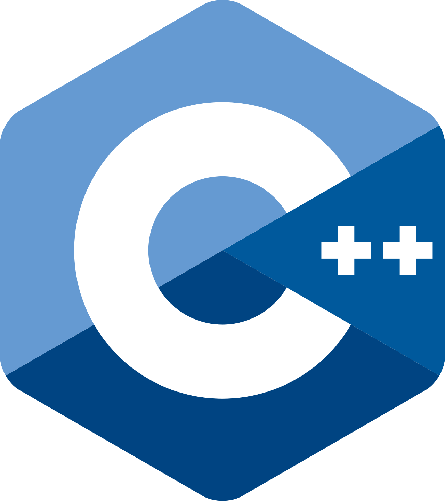

---
layout:
  width: wide
  title:
    visible: true
  description:
    visible: true
  tableOfContents:
    visible: true
  outline:
    visible: true
  pagination:
    visible: true
  metadata:
    visible: true
  tags:
    visible: true
  actions:
    visible: true
---

# Lenguaje de programación: C++

<figure><figcaption></figcaption></figure>

[C++](https://isocpp.org/) es un lenguaje de programación de alto nivel y propósito general diseñado por Bjarne Stroustrup, concebido como una extensión del lenguaje de programación C para añadir mecanismos que permiten la manipulación de objetos, "genericidad" y programación funcional. Su primera versión vio la luz en 1985, y la última versión estable (C++23) se lanzó en Diciembre de 2023. Es el lenguaje vehicular que usamos en la asignatura "Programación" (Semestre 1B) y que continuaremos usando en "Programación Avanzada" (Semestre 2A).

En caso de no tener instalado el compilador de C++ en tu sistema operativo (`g++`), aquí tienes las (breves) instrucciones de instalación:



```bash
sudo apt update
sudo apt install g++
```



```bash
sudo dnf install gcc-c++
```



Instalar la app XCode desde la App Store.



A continuación os dejamos una lista de recursos que pueden seros útiles para consultar características del lenguaje:

* [**The C++ programming language**. Bjarne Stroustrup. Editorial Addison-Wesley. 4a Edición.](https://polibuscador.upv.es/discovery/search?institution=UPV\&query=any,contains,990004703880203706\&vid=34UPV_INST:bibupv)
* [**C++ Programming | In one video** (Youtube - Giraffe academy)](https://www.youtube.com/watch?v=raZSmcariyU)
* [**Standard C++ Library Reference**](https://cplusplus.com/reference/)


Recordad que también disponéis del material de la asignatura "Programación" del semestre 1B.&#x20;

