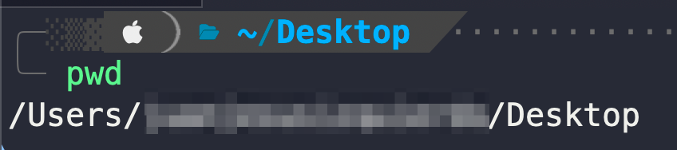
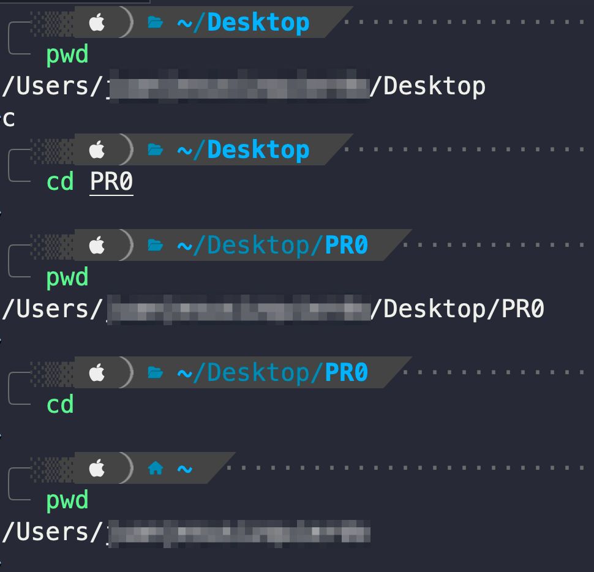
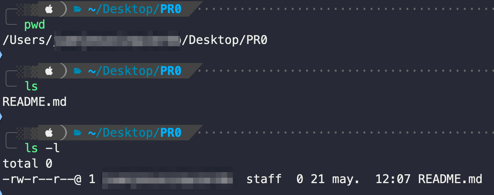
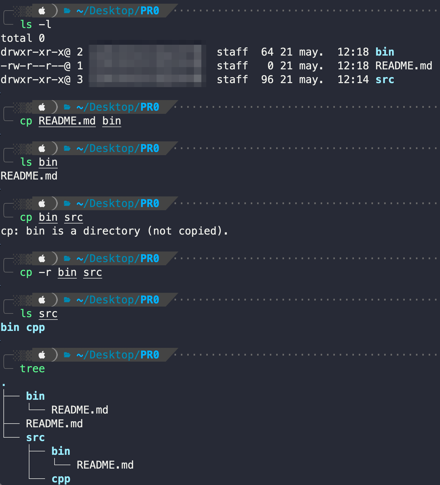

# Comandos básicos

La siguiente tabla contiene los 8 comandos básicos más utilizados de la terminal Linux, esenciales para realizar las prácticas:

<table><thead><tr><th width="135">Comando</th><th>Descripción</th></tr></thead><tbody><tr><td><strong><code>pwd</code></strong></td><td><em><strong>(print working directory):</strong></em> Muestra el directorio de trabajo actual.</td></tr><tr><td><strong><code>cd</code></strong></td><td><em><strong>(change directory):</strong></em> Cambia el directorio de trabajo de la terminal.</td></tr><tr><td><strong><code>ls</code></strong></td><td><em><strong>(list)</strong></em> Lista los contenidos (ficheros y subdirectorios) de un directorio.</td></tr><tr><td><strong><code>cat</code></strong></td><td><em><strong>(concatenate)</strong></em>: muestra por pantalla el contenido de un fichero.</td></tr><tr><td><strong><code>mkdir</code></strong></td><td><em><strong>(make directory)</strong></em>: crea uno o varios directorios.</td></tr><tr><td><strong><code>rm</code></strong></td><td><em><strong>(remove):</strong></em> elimina ficheros o directorios. </td></tr><tr><td><strong><code>cp</code></strong></td><td><em><strong>(copy):</strong></em> copia ficheros o directorios.</td></tr><tr><td><strong><code>mv</code></strong></td><td><em><strong>(move):</strong></em> mueve/renombra ficheros o directorios</td></tr></tbody></table>

Si os interesa, podéis consultar un listado más amplio de comandos básicos [en este enlace.](https://www.unixtutorial.org/basic-unix-commands)

***

### Comandos importantes

**`pwd`** _**(print working directory):**_ Muestra el directorio de trabajo actual.

<figure><figcaption></figcaption></figure>

***

**`cd`**`<DIR>` _**(change directory):**_ Cambia el directorio de trabajo al directorio `<DIR>`.

* En caso de no proporcionar un directorio `<DIR>` como argumento, cambia al directorio home del usuario (sería equivalente a la llamada `cd $HOME`).

<figure><figcaption></figcaption></figure>

***

**`ls`**`<DIR>` _**(list):**_ Lista los contenidos (ficheros y subdirectorios) del directorio `<DIR>`.

* En caso de no proporcionar un directorio `<DIR>` como argumento, lista los contenidos del directorio actual (sería equivalente a la llamada `ls .`).
* La opción `-l` nos permite mostrar una lista ampliada con las propiedades de los ficheros y subdirectorios (permisos, propietarios, tamaño, y fecha de modificación).

<figure><figcaption></figcaption></figure>

***

**`cat`**`<FILE>` _**(concatenate)**_: muestra por pantalla el contenido del fichero `<FILE>`.

<figure><figcaption></figcaption></figure>

***

**`mkdir`**`<DIR>` _**(make directory)**_: crea el directorio `<DIR>`.

* La opción `-p` (`--parents`) permite crear todos los directorios predecesores necesarios, en caso de que `<DIR>` sea una ruta de varios niveles de directorios y alguno de ellos no exista.

<figure><figcaption></figcaption></figure>

***

**`rm`**`<PATH>` _**(remove):**_ elimina ficheros o directorios.

* Para eliminar directorios, debemos especificar la opción `-r` (`--recursive`).


**Peligro!** No existe una "papelera de reciclaje": cualquier fichero o directorio eliminado con `rm` se "pierde" para siempre. Id con cuidado cuando useis este comando.


<figure><figcaption></figcaption></figure>

***

**`cp`**` ``<SRC> <TRG>` _**(copy):**_ copia el fichero o directorio `<SRC>` en `<TRG>`.

* Para copiar directorios, debemos especificar la opción `-r` (`--recursive`).

<figure><figcaption></figcaption></figure>

***

**`mv`**` ``<SRC> <DST>` _**(move):**_ mueve el fichero o directorio `<SRC>` a `<TRG>`.

* Nos sirve tanto para mover ficheros a otros directorios, como para cambiar el nombre de un fichero.

<figure><figcaption></figcaption></figure>
