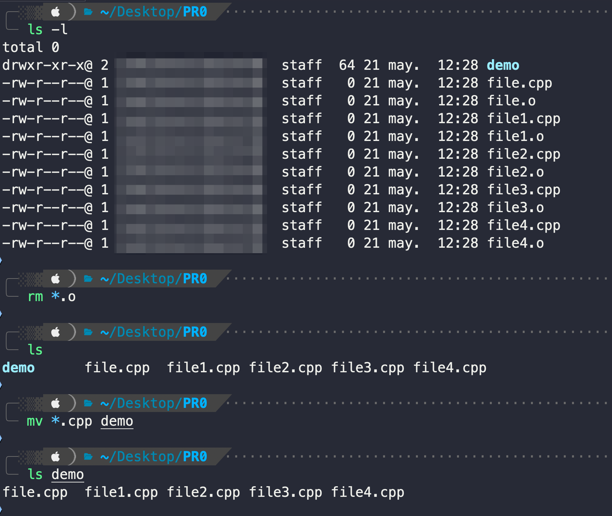
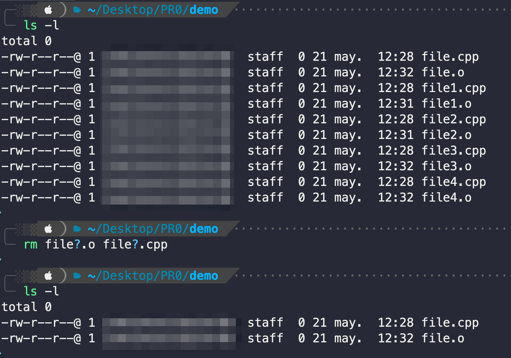
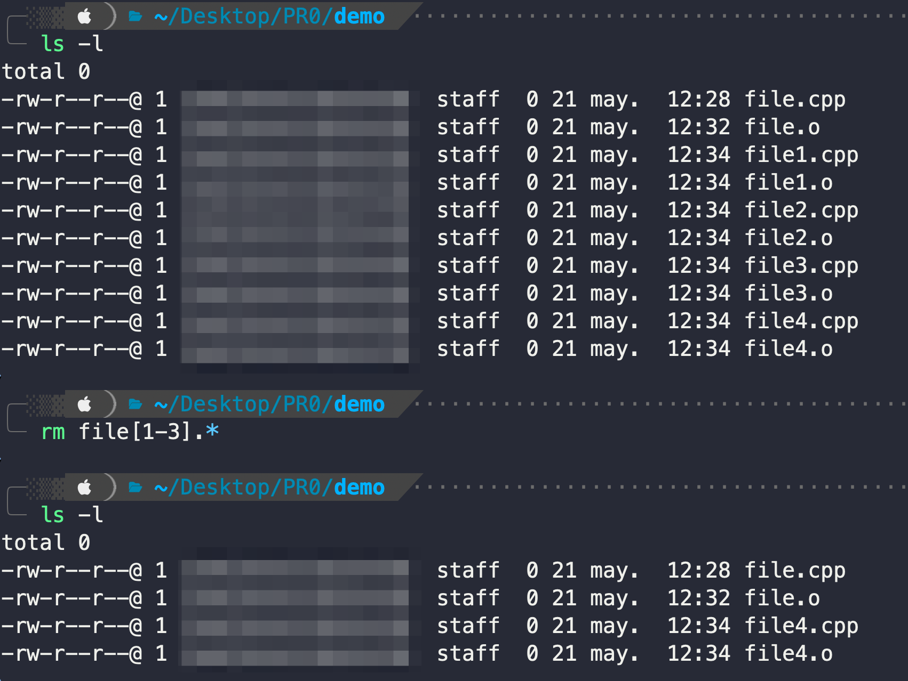

# Comodines (wildcards)

Una característica muy útil de la terminal de Bash son los denominados comodines o wildcards. Nos permiten **definir patrones de búsqueda/unificación de ficheros y directorios para realizar operaciones por lotes**. Hay tres tipos de wildcards:

***

**`*` (asterisco)**: busca/unifica cualquier secuencia de 0 o más caracteres.Ejemplos de uso:

* `rm *.o` -> elimina todos los ficheros del directorio de trabajo actual que acaben con `.o`.
* `mv *.cpp p0/` -> mueve todos los ficheros que acaban en `.cpp` al directorio `src`.

<figure><figcaption></figcaption></figure>

***

**`?` (interrogante):** busca/unifica cualquier carácter.

Ejemplos de uso:

* `rm file?.o` -> elimina todos los ficheros que empiezan por `file`, seguidos de cualquier carácter, y que acaban en `.o`. (p.e. `test1.o`, `test2.o`, `testA.o`, etc.)

<figure><figcaption></figcaption></figure>

***

**`[]` (corchetes)**: busca/unifica cualquier carácter o rango de caracteres especificados dentro de los corchetes.

Ejemplos de uso:

* `rm file[1-3].o` -> elimina todos ficheros empiezan por `file`, seguidos de algun carácter comprendido entre el rango `1-3` (es decir: 1, 2 ó 3), y que acaban en `.o` (p.e. `file1.o`, `file2.o`, `file3.o`).

<figure><figcaption></figcaption></figure>
